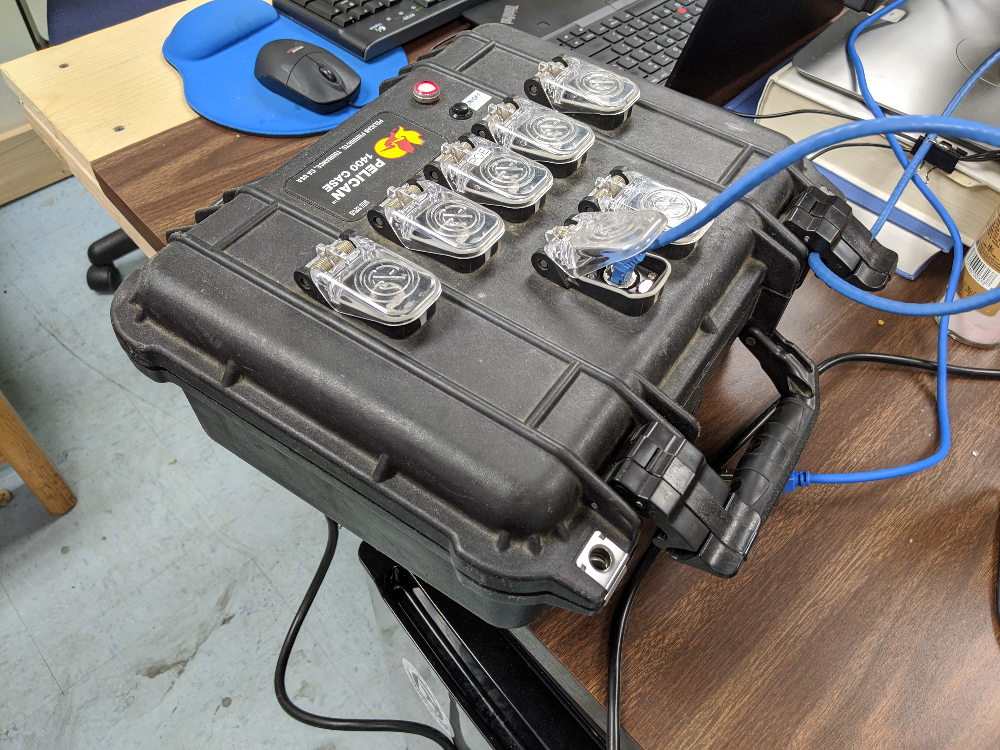

# Network Box

The Network Box is a pelican case containing the components needed
to duplicate the [MIL network](network) while out testing or at competition.
It is intended to make networking in these enviroments seemless and portable.
The box is powered by a UPS so can operator for roughly an hour
without being plugged into a wall outlet.

## Usage
To use the Network Box:
* If possible, plug the box into wall power using the special cable
* Turn the box on by holding down the ON button until you hear a beep and the RED led turns on
* Connect your/other developer laptops via ethernet to any of the top ports BESIDES the one labeled POW
  * Be sure your laptop is configured to automaticaly configure network over DHCP
  * If your laptop does not have Ethernet (RJ45), you can use one of the provided adapters inside the box
* Connect the vehicle to the box. If connecting the Ubiquitii Antenna, connect it to the POW port
* Wait a few minutes until your PC reports it is connected to the network
* To verify functionality, try pinging the vehicle or accessing the [configuration panel](#Configuration)

## Hardware

## IO
* 7 LAN connections on the outside of the box connected to the internal switch
  * 1 labeled POE and is connected to a Ubiquity POE injector used to connect
the Ubuiquity antena
* 1 WAN ethernet which connects directly to the PFsense router WAN port
* A power cable 
* Internal WIFI antena
* Labeled On/Off button (must hold)
* Red power indicator LED

## Internal
* [TREDnet TI-G80 8-port gigabit switch](https://www.trendnet.com/products/industrial-switches/TI-G80)
* [Xtreme J60-OE350 AC UPS](https://www.amazon.com/Xtreme-Power-Conversion-J60-350-Lithium/dp/B01M6Z1LJP/ref=pd_sbs_421_t_2/134-1879969-9121638?_encoding=UTF8&pd_rd_i=B01M6Z1LJP&pd_rd_r=b8c3ce7f-63e7-4436-94b9-1167024d1f20&pd_rd_w=pt6dy&pd_rd_wg=tIffo&pf_rd_p=5cfcfe89-300f-47d2-b1ad-a4e27203a02a&pf_rd_r=1FV7RXC72XPWH0T5AA14&psc=1&refRID=1FV7RXC72XPWH0T5AA14)
* [Protectli FW10408 PFsense router](https://protectli.com/product/fw1/)
* AC to 12v 5A DC adapter spliced to power both the switch and router
* Ubiquiti GP-A240-050G POW injector
* 2 Amazon Basics USB to RJ45 devices velcrowed to the lid for developers without a RJ45 port

## Configuring
**Warning: bad changes to the network box config can break
communication between developers and robots. Proceed with causion.**
You can configure things such as the WAN (internet) connection, DHCP server,
etc by logging into the PFsense web panel at [https://192.168.37.1](https://192.168.37.1) (accept the invalid certificate). Ask a MIL leader for the login credentials.

## Backup / Restore
We store the XML config of the router within the repo. [Find the latest config on github](https://google.com)
You can update this config or restore it from the web panael at [https://192.168.37.1/diag_backup.php](https://192.168.37.1/diag_backup.php).

### WAN Setup
**WARNING: do not connect the MIL network or any other network using our subnet to the WAN port. This can cause serious issues for both networks
as both will have an active DHCP server**
At competition, we are often given a WAN (internet) cable. Plug this cable into the WAN port on the box. Once connected,
try pinging an internet server `ping 8.8.8.8`.
